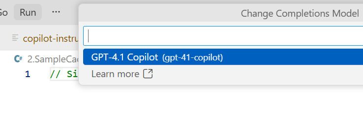
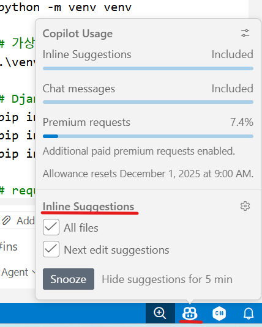
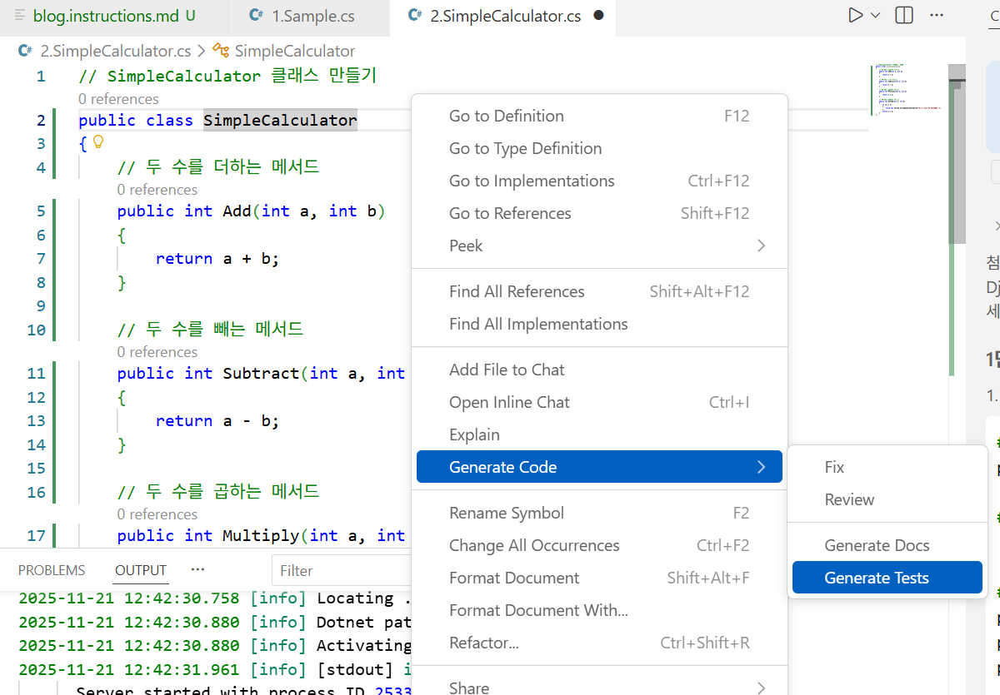
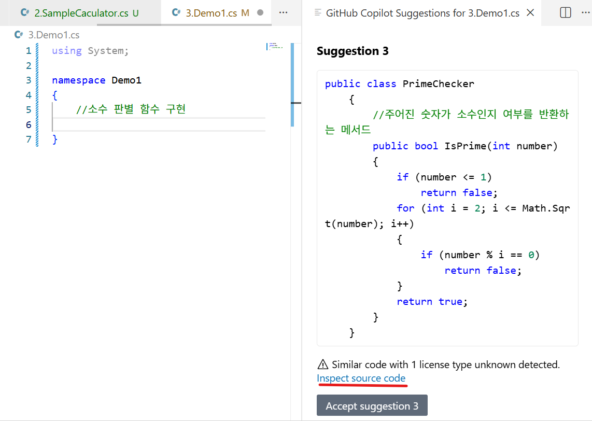
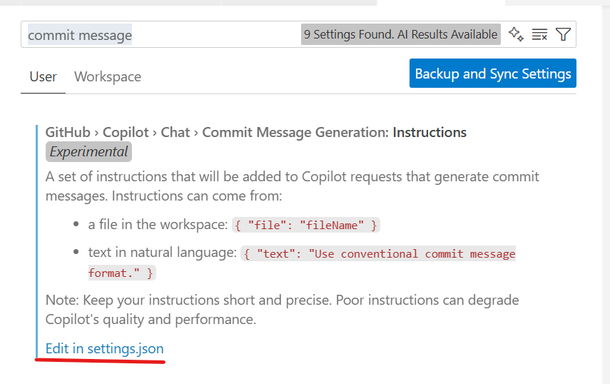
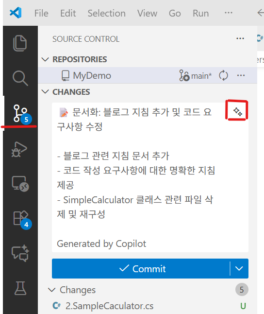

## 1. Code Completion 활용

1. Chat Completion과 인라인 Chat(Ctrl+I), Copilot Chat 설명
    - Standard Model과 Premium Model의 차이
    - 각 Chat 타입 별 AI 모델 차이 설명
    - Auto Model 설명 (10% 할인)

2. Chat Completion을 수행하는 모델 확인 방법
    - Ctrl+Shift+P를 눌러 나오는 팔레트 창에서, GitHub Copilot: Change Completions Model 입력
    
    - 현재, Chat Completion을 수행하는 모델은 GPT 4.1임을 확인
    - 이 모델은 시간이 지남에 따라 자동으로 변경될 수 있음.

        > 참고 : Change the AI model for completions  
        > 출처: <https://code.visualstudio.com/docs/copilot/ai-powered-suggestions> 

    - Code Completion 비활성화 방법
        - VS Code 우측 하단에 GitHub 아이콘을 클릭하면, 다음과 같은 창이 나온다.
        
        - Inline Suggestions에서 All Files의 체크표시를 지우면, 이제 Code Completion은 동작하지 않는다.

3. Sample.cs 파일
    - '// Person 클래스 만들기' 문장 뒤에서 엔터를 치고, 자동생성되는 코드를 수락
    - '// Person 클래스를 상속하는 Employee 클래스 만들기' 문장 뒤에서 엔터를 치고, 자동생성되는 코드를 수락
    - Person 클래스에 다음의 Property를 추가해 본다. NSE가 동작하여 바로 제안을 해주는 것을 확인
        ```csharp
        public string Gender { get; set; }
        ```

4. SimpleCalculator.cs 파일
    - // SimpleCalculator 클래스 만들기 문장 뒤에서 엔터를 치고, 자동생성되는 코드를 수락

    - 클래스가 생성되면, 클래스 코드 전체 선택하고 **Generate Code > Tests** 선택 
        
    - 이 경우, 인라인 챗 윈도우에서 가장 최근에 사용했던 AI 모델을 사용해서 수행함.
    - 테스트 파일이 생성되고, 테스트 코드가 작성되는 것 확인 및 저장
    - 저장은 자동으로 되지 않으니, 꼭 수동으로 저장해야 한다.
    - 혹은 다른 방법으로 Ctrl+I를 눌러서 인라인 챗 윈도우를 띄운다음, 거기서 /tests 를 수행해도 됨
    - 이 경우, AI 모델을 변경할 수 있음.

5. Demo1.cs
    - // 소수 판별함수 구현  다음 줄에서 엔터치고 생성되는 코드를 살펴본다
    - Ctrl + Enter를 쳐서 다른 제안도 함께 살펴봄. 다음과 같이 유사 코드를 알려주기도 함.
        
    - 제안된 코드 중 상기 그림처럼 **inspect source code**라는 것이 표기되면, 이 코드는 Public GitHub에 존재하는 코드와 동일한 코드를 의미함. Copilot Setting 에서 관리자는 이런 코드가 제안되지 않게 설정 가능함.
    - 작성된 메서드 이름에서 Ctrl+I를 눌러서 인라인 챗을 띄우고 /doc를 수행
    - 영문으로 summary가 작성되는 것을 확인
    - 그 다음 '/doc 한글로 '라고 변경해서 입력 실행   
        

6. Git 커밋 메시지 자동생성
    - Ctrl+Alt+P를 눌러서 팔레트 창에서 Preferences: Open Settings [UI]를 입력하고, 설정창이 나타나면 검색어로 commit message를 입력
    

    - Edit in settings.json 클릭하고 다음과 같이 변경
        ```json
            "github.copilot.chat.commitMessageGeneration.instructions":  [
                { "text": "한글(Korean)로 작성합니다" },
                { "text": "각 Subject마다 다양한 Emoji를 사용합니다." },
                { "text": "Footer에 Commit 요약을 작성합니다" },
                { "text": "커밋 메시지에 'Generated by Copilot' 추가" }     ]
        ```

    - 변경 후, settings.json 파일 저장
    - Git Commit 창에 있는 버튼을 클릭하면, 자동으로 커밋 메시지가 작성되는 것을 확인
        

