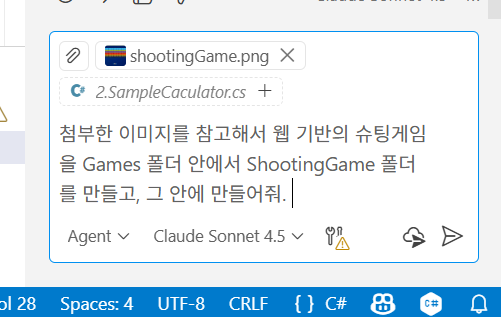
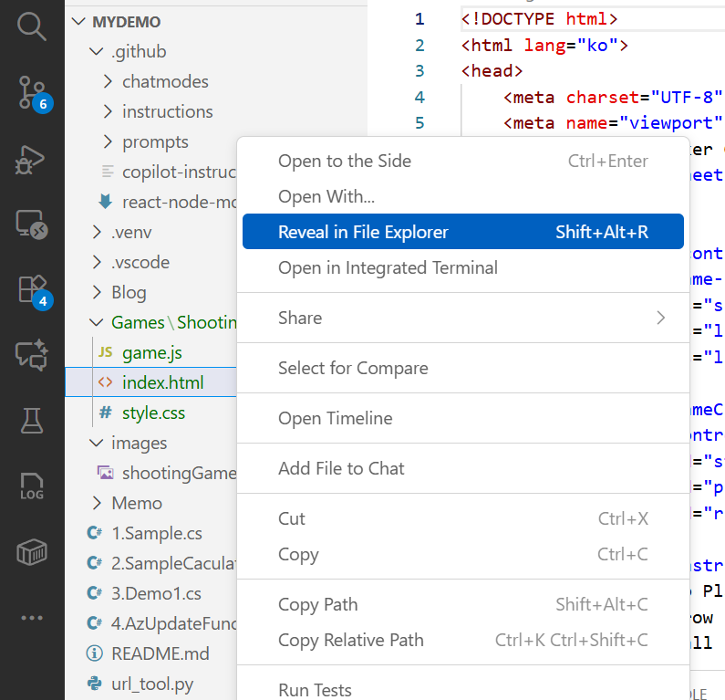
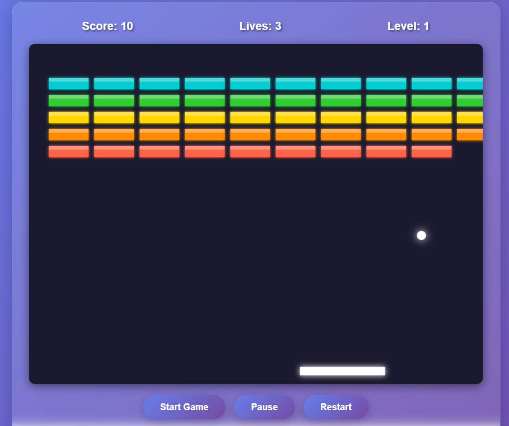
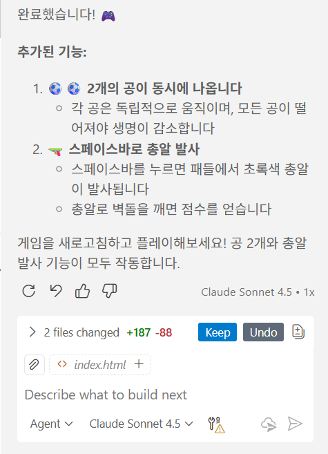
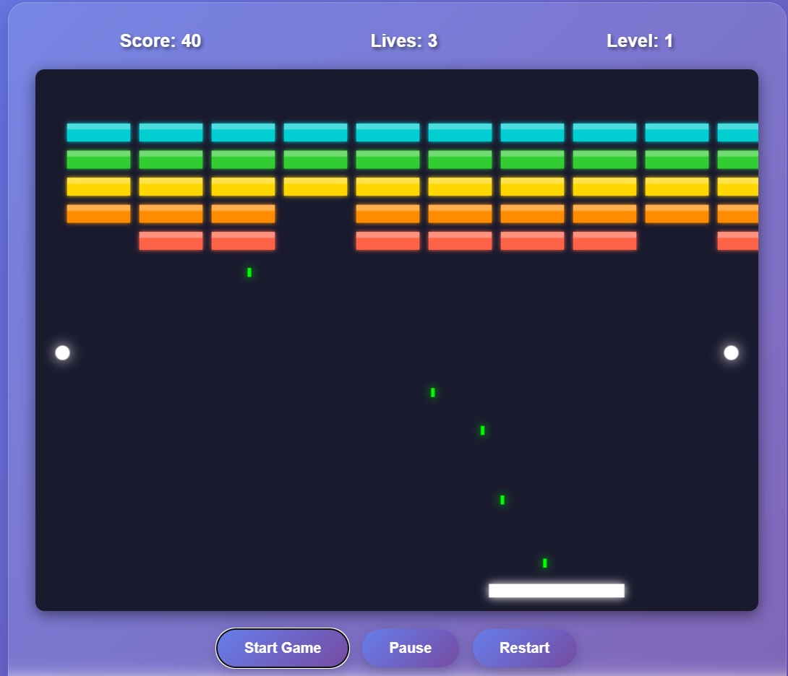
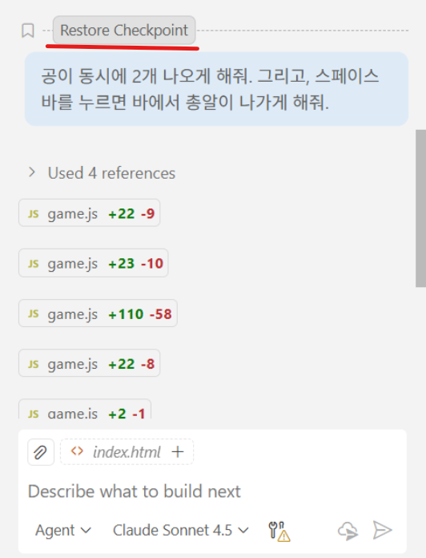

1. 온라인 슈팅 게임 만들기 (Claude sonnet 4.5 기반)
    - VS Code에서 Copilot을 Agent 모드로 설정하고, AI 모델은 Claude sonnet 4.5로 선택한다.
    - Images 폴더에 있는 shootingGame.png 이미지를 드래그 앤 드롭하여 Agent 창에 추가한다.
    - 파일이 첨부되었으면, 다음과 같은 프롬프트를 입력한다
    
        > 첨부한 이미지를 참고해서 웹 기반의 슈팅게임을 Games 폴더 안에서 ShootingGame 폴더를 만들고, 그 안에 만들어줘.

        
    - 개발이 다 되었다면, Keep을 눌러서 모든 변경사항을 수락한다.
    - 생성된 Index.html을 다음과 같이 탐색기에서 열고, 더블클릭하여 브라우저에서 실행한다.
        
    - 게임이 잘 수행되는 것을 확인한다.
        

    - 만일, 공이 핑퐁되는 게임이 아니라 바에서 총알이 발사되는 게임이 만들어졌다면, 프롬프트를 개선해서 게임을 변경해 본다. 예시 프롬프트는 다음과 같다.
     
        > 공이 Bar에 맞고 튕기는 것이 아니라 바닥을 맞고 튕기고 있어. 바에 맞고 튕기도록 개선해줘

    - 게임이 정상적으로 만들어 졌다면, 추가적으로 다음 프롬프트를 입력하여, 게임을 좀 더 재미있게 바꿔본다.
    
        > 공이 동시에 2개 나오게 해줘. 그리고, 스페이스 바를 누르면 바에서 총알이 나가게 해줘.
    
        
    - 개발이 다 되었다면, Keep을 눌러서 모든 변경사항을 수락한다.

        

    - 그리고, 브라우저를 새로고침하여 변경된 게임을 실행해 본다. 훨씬 박진감 넘치는 게임이 되었을 것이다.
    
        

    - VS Code의 Copilot 창에서 가장 최근에 입력했던 프롬프트까지 스크롤을 올린다. 이전 프롬프트 바로 위에 리본이 있을텐데, 그 리본에 마우스를 올리면 리본 아이콘 옆에 **Restore Checkpoint**라는 것이 나타난다. 이를 클릭하면, 현재 워크스페이스와 채팅 기록은 모두 방금 전 프롬프트 이전의 상태로 모두 되돌아간다. 즉, 공이 동시에 2개 나오는 기능과 총알이 나오는 기능은 모두 제거되고 이전 상태로 돌아갈 것이다. "Restore Checkpoint"를 누른다.

        

    - Keep을 눌러서 모든 변경사항을 수락한다.
    - 그리고, 브라우저를 리프레시하고 원래대로 게임이 돌아갔는지를 확인한다.