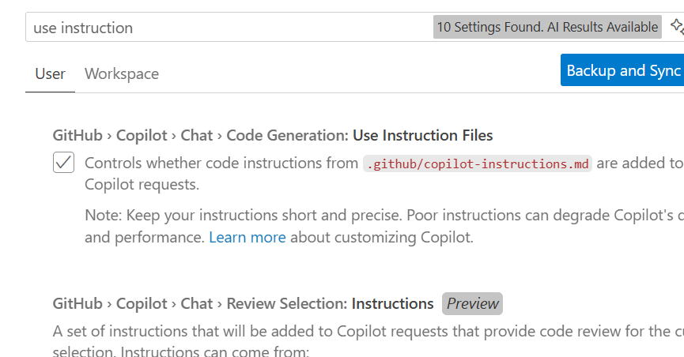
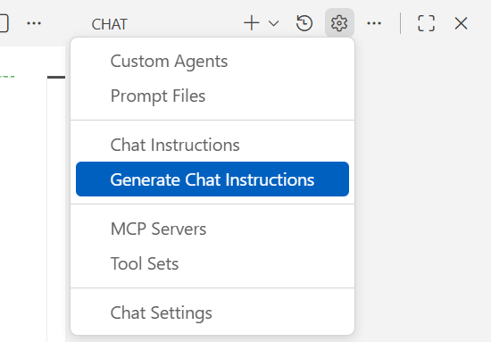
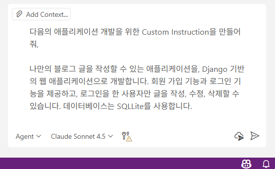
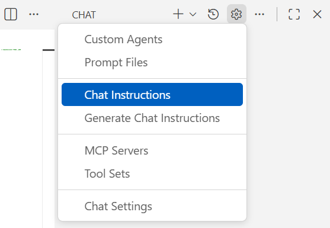
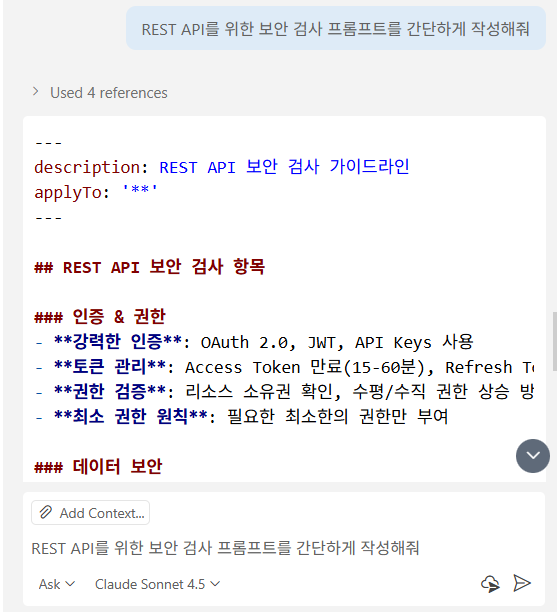
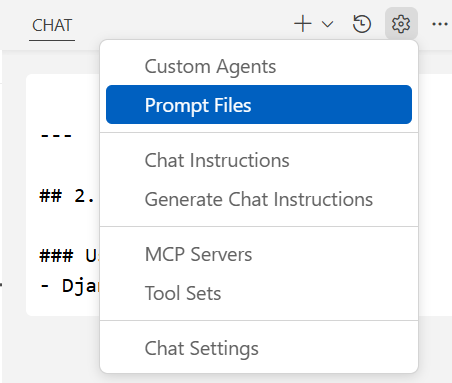
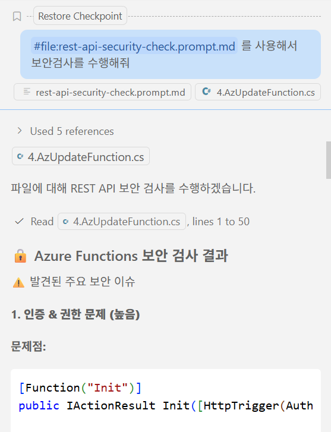
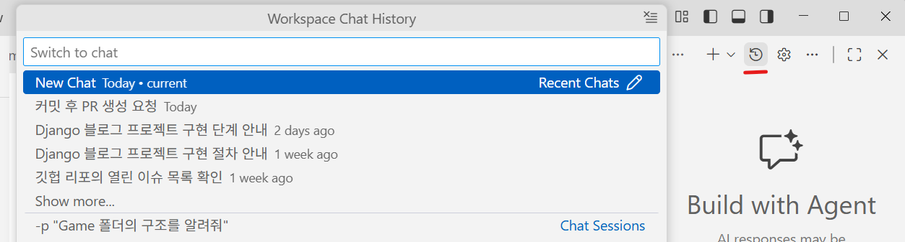

1. Custom Instructions 설명

    출처 : https://github.com/Kor-GHCPWorkshop/CopoilotWorkshop-VSCode-Py-HDA/blob/main/Task03/README.md

    GBB 손건님이 작성하신 문서를 열어두고 설명을 먼저 진행한다.

    - Ctrl+Alt+P를 눌러서 명령창에서 “Preferences: Open Settings [UI]"에서 use instruction 입력. 
        - 기본적으로 custom instruction을 사용하도록 체크되어 있음을 확인
    

2. Custom Instruction 만들기
    - Copilot 상단의 톱니바퀴를 클릭하고, [Generate Chat Instrunctions]를 선택하면, 현재 workspace의 파일들을 분석해서 지침이 만들어진다. 지침은 copilot-instructions.md라는 이름으로 .github 폴더 밑에 생성된다.
        

3. 개별 지침 만들기
    - 새로운 VS Code를 실행한다
    - 비어있는 화면에서, Chat 윈도우를 Agent 모드로 열고, 다음의 프롬프트를 입력한다
        
        > 다음의 애플리케이션 개발을 위한 Custom Instruction을 만들어줘.
        >
        > 나만의 블로그 글을 작성할 수 있는 애플리케이션을, Django 기반의 웹 애플리케이션으로 개발합니다. 회원 가입 기능과 로그인 기능을 제공하고, 로그인을 한 사용자만 글을 작성, 수정, 삭제할 수 있습니다. 데이터베이스는 SQLLite를 사용합니다.   

        
        
    - Custom Instruction이 생성되는 것을 확인하고, 필요하다면 내용을 수정하여 나만의 Instruction을 다듬는다. 
        
    - 기존의 VS Code로 돌아온다.
    - Copilot 상단의 톱니바퀴를 클릭하고, Chat Instructions를 선택한 다음, 수동으로 **blog.instructions.md**을 입력하여 파일을 만든다.

        

    - 앞에서 코파일럿이 만들어 준 blog.instructions.md 내용을 붙여 넣는다.
    - 참고: 이후의 데모에서는 별도로 준비되어 있는 .github/instructions/blog.instructions.md을 사용한다

4. 프롬프트 만들기
    - 새로운 VS Code를 실행한다(기존의 custom instruction을 만든 창을 재활용한다).
    - 비어있는 화면에서, Chat 윈도우를 Agent 모드로 열고, 다음의 프롬프트를 입력한다
    
        >REST API를 위한 보안 검사 프롬프트를 간단하게 작성해줘
    
        

    - 생성된 결과 텍스트를 복사한다.
    - 기존의 VS Code 창으로 돌아와서, Copilot 상단의 톱니바퀴를 클릭하고, Chat Instructions를 선택한 다음, **rest-api-security-check.prompt.md** 파일을 만든다.
        

    - AzUpdateFunction.cs 파일을 열고, 다음의 프롬프트를 입력한다.

        > #file:rest-api-security-check.prompt.md 를 사용해서 보안 검사를 수행해줘

        
    
4. Chat History Windows 설명. 
        
    - Chat Windows  별로 코딩관련 Chat, 문서 관련 Chat를 따로 관리하는 장점 안내
