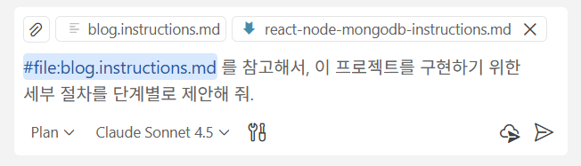
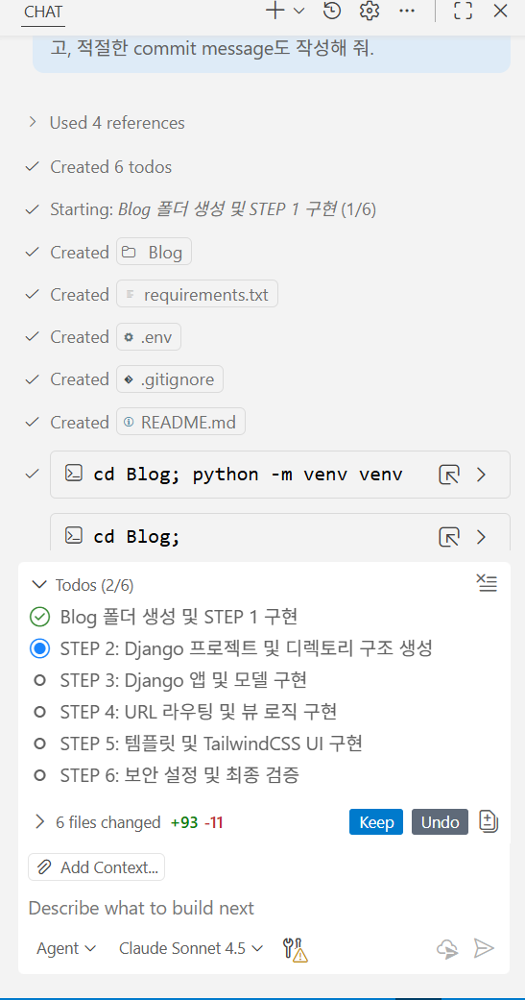
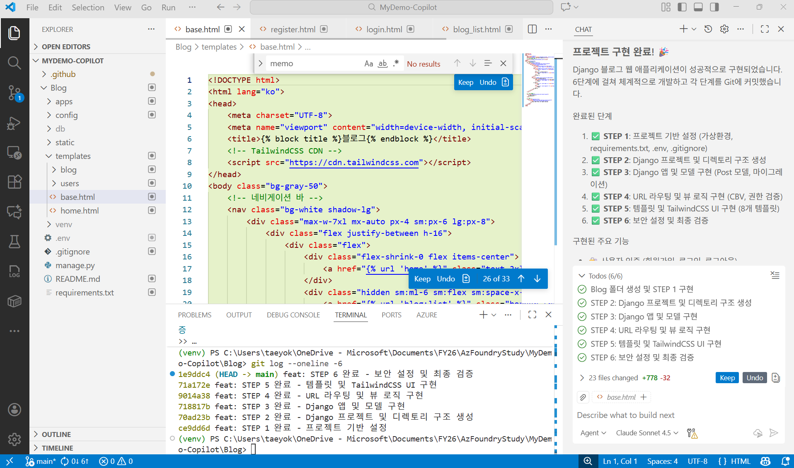
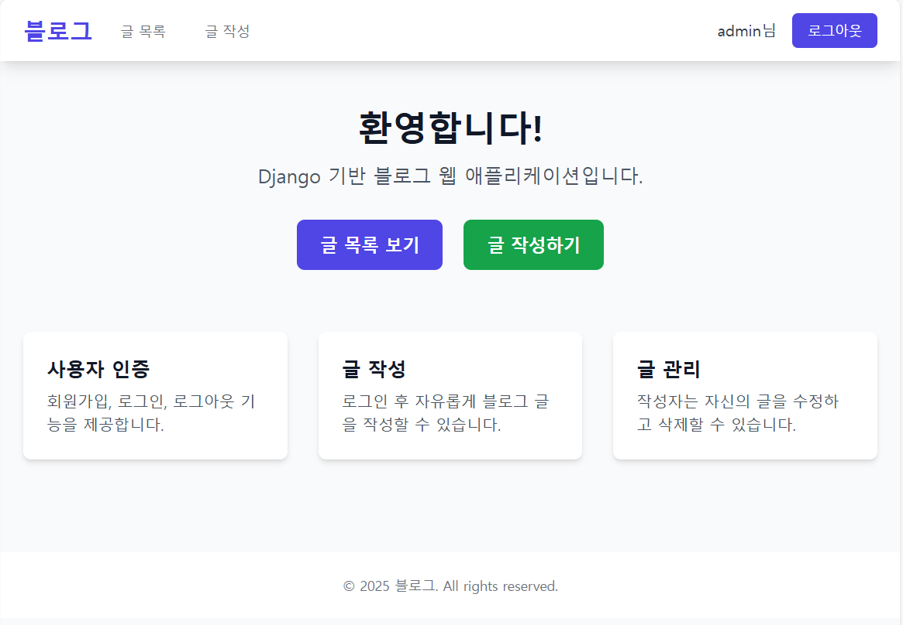
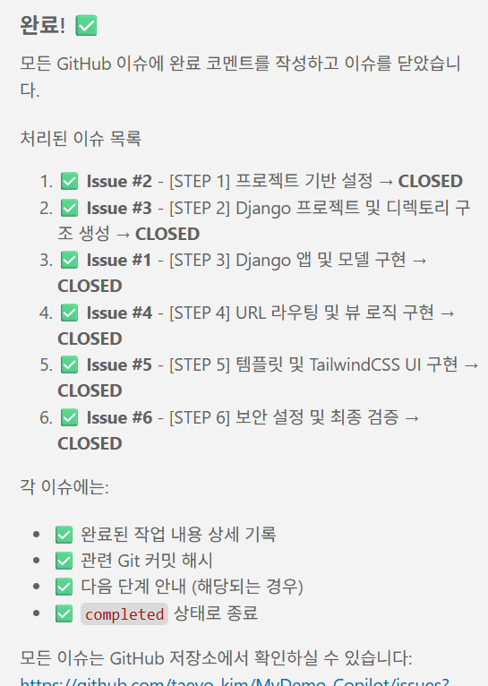

1. Custom Agent(Plan mode)를 만드는 예를 보여준다(메뉴가 사라져서 못 보여주면 패스) 
    - 원래 이전에는 Chat Mode 였는데 이젠, Custom Agent로 명칭이 바뀜.

2. Blog.instruction.md 를 사용해서 앱을 개발하기
    - 이미 테스트를 수행한 MyDemo 리포에는 개발된 Blog가 존재하므로, 데모 시연을 위해서 MyDemo-Copilot 리포를 열고, 그곳에서 신규 데모를 수행한다
    
    - 수행되는 모습만 MyDemo-Copilot에서 보여주고, 기존의 MyDemo로 돌아가서 완성된 모습을 보여준다
    
    - Copilot의 **Plan 모드**에서, 다음과 같이 프롬프트 요청

        > #file:blog.instructions.md 를 참고해서, 이 프로젝트를 구현하기 위한 세부 절차를 단계별로 제안해 줘

        

    - Plan을 확인하고 난 뒤에는, **Agent 모드**로 전환한 뒤, 다음과 같이 프롬프트 요청

        >위의 각 구현단계를 각각 현재 워크스페이스의 origin 원격 저장소에 이슈로 등록해줘
    
    - 이슈가 모두 등록된 것을 확인하고 난 뒤에는, **Agent 모드**로 전환한 뒤, 다음과 같이 프롬프트 요청

        > 이제 이 프로젝트를 구현해보자. 현재 워크스페이스에 /Blog 폴더를 만들고, 그 안에다 위에서 제시된 각 단계별로 구현을 진행해 줘. 단계별로 완료된 내용을 commit하고, 적절한 commit message도 작성해 줘.

        

        

        

    - 구현이 모두 완료된 것을 확인하고 난 뒤에는, **Agent 모드**로 전환한 뒤, 다음과 같이 프롬프트 요청

        > 이제 GitHub의 Origin 원격저장소에 있는 이슈들에 대해서 완료된 내용들을 comment하고 해당 이슈를 close 해 줘.
        
        

참고 :  
터미널에서 직접 실행할 경우,   
cd blog  
python ".\manage.py" runserver
