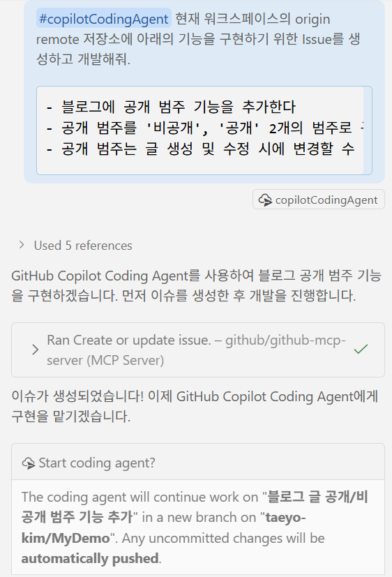
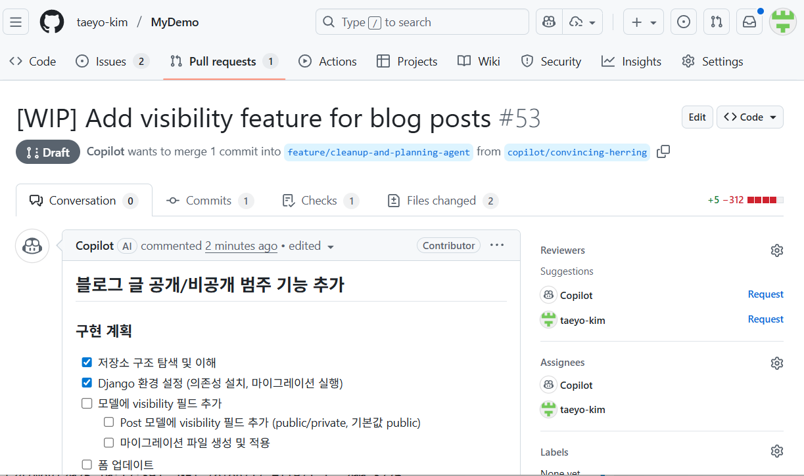
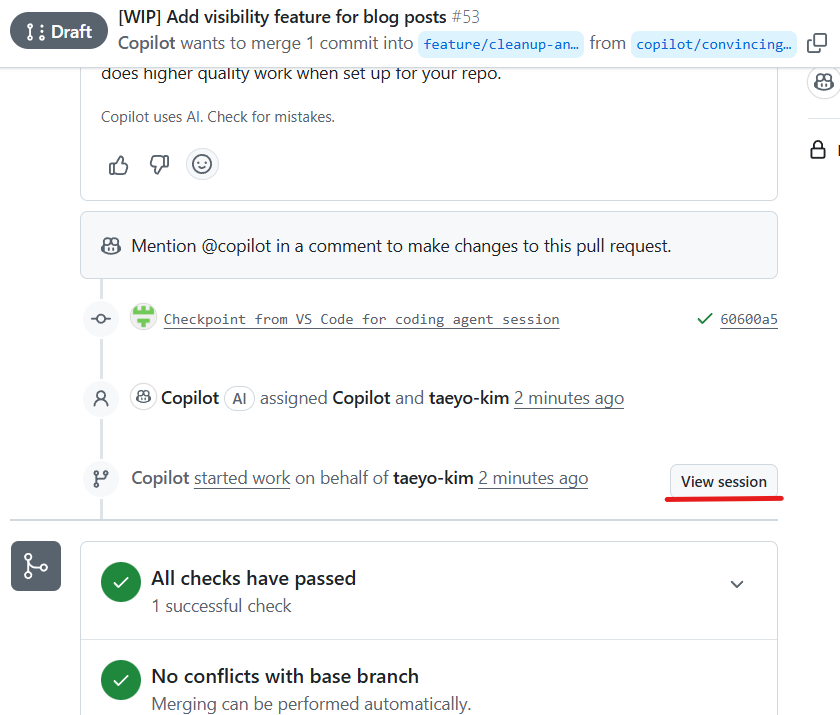
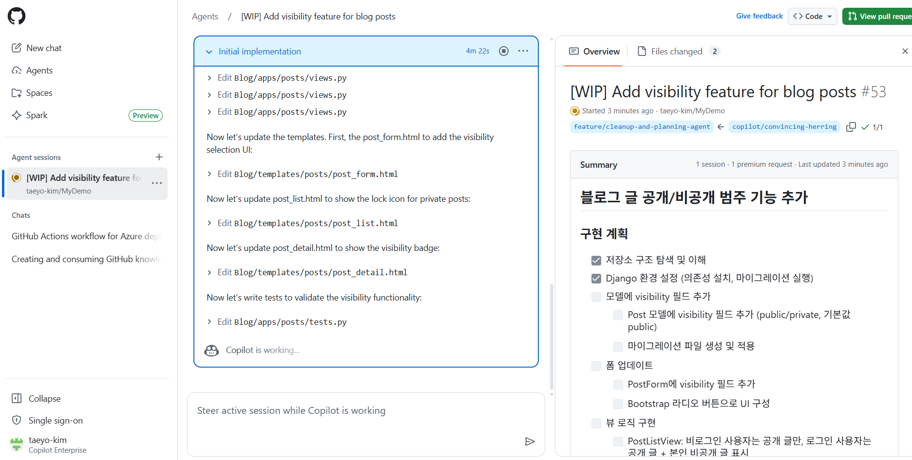
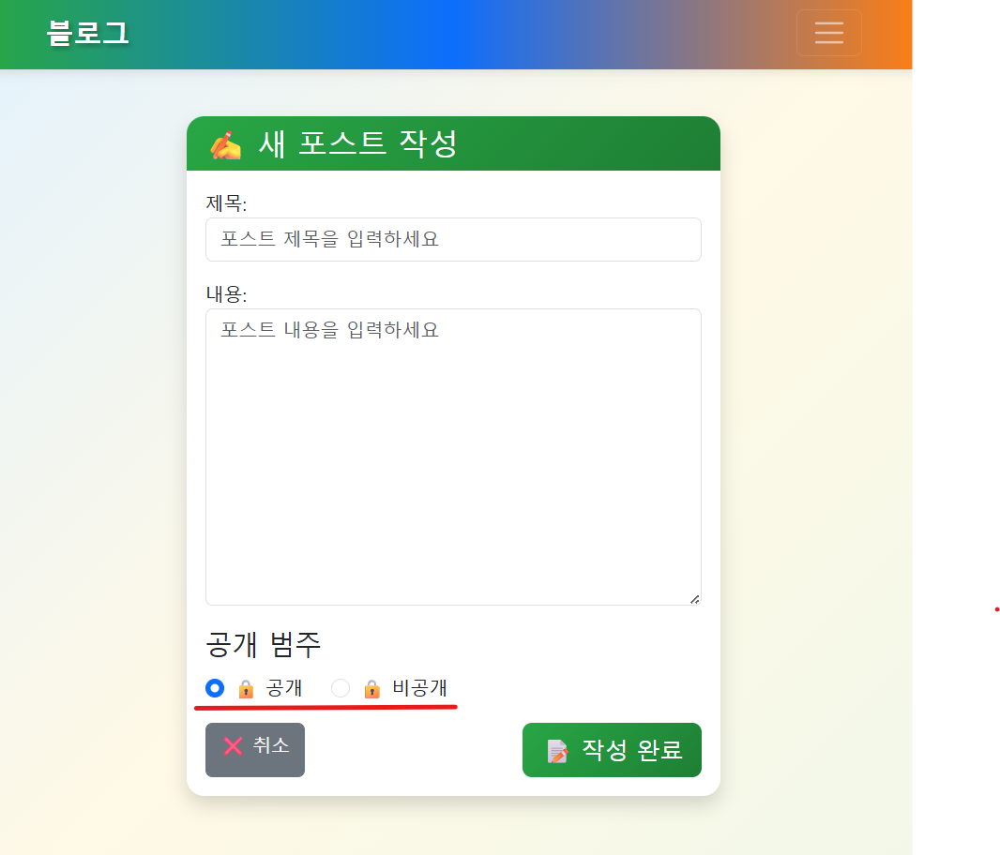
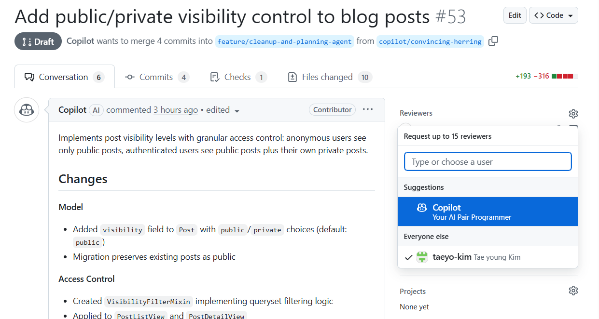
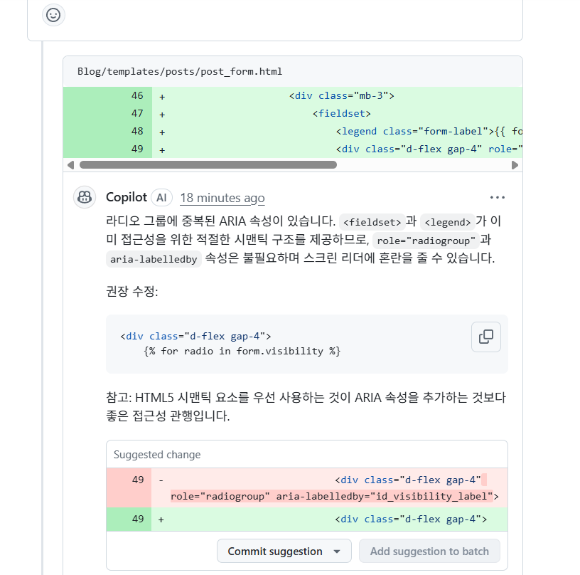

## Coding Agent와 Reviewer 데모

참고 : https://docs.github.com/ko/enterprise-cloud@latest/copilot/concepts/agents/coding-agent/about-coding-agent

현재는 Claude Sonnet 4.5 모델을 사용 중(2024년 11월 기준).
__Currently, Copilot coding agent uses Claude Sonnet 4.5.__

- Chat 윈도우에서 **Agent 모드**를 선택한 뒤, 다음과 같이 프롬프트 요청한다.

> #copilotCodingAgent 현재 워크스페이스의 origin remote 저장소에 아래의 기능을 구현하기 위한 PR을 생성하고 개발해줘. 
>
>    - 블로그에 공개 범주 기능을 추가한다
>    - 공개 범주를 '비공개', '공개' 2개의 범주로 구성한다.
>    - 공개 범주는 글 생성 및 수정 시에 변경할 수 있다.
>  

상기 프롬프트를 이미 사용했다면, 다음과 같이 변경해서 사용한다.

>#copilotCodingAgent 현재 워크스페이스의 origin remote 저장소에 아래의 기능을 구현하기 위한 PR을 생성하고 개발해줘. 
>    - 블로그의 글 밑에 댓글을 작성할 수 있는 기능 추가
>    - 댓들은 로그인한 사용자만 작성할 수 있으며, 수정과 삭제가 가능해야 함.
> 

VS Code에서 Copilot Agent가 생성한 Branch로 이동해서, 변경된 소스가 올바로 동작하는 지 확인한다. 

GitHub Repo로 이동하여, Pull Request을 보면 개발이 완료된 것을 볼 수 있다. 
Reviewers에 Copilot를 추가하여, 코파일럿을 활용한 개발 리뷰를 시작한다. 

리뷰가 진행됨에 따라 PR 페이지에 Copilot이 리뷰를 추가하는 것을 확인할 수 있다.

