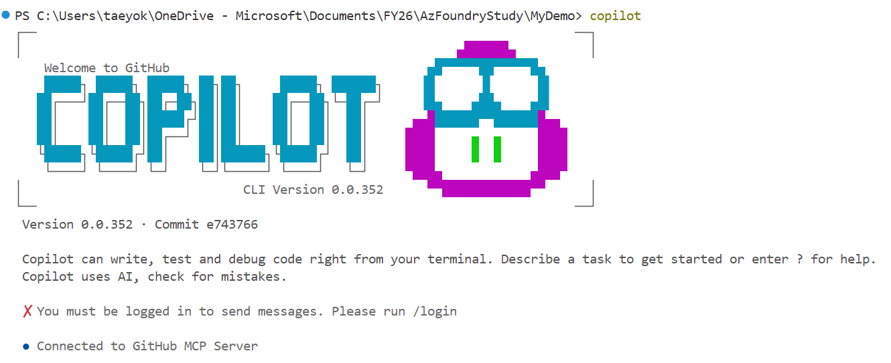
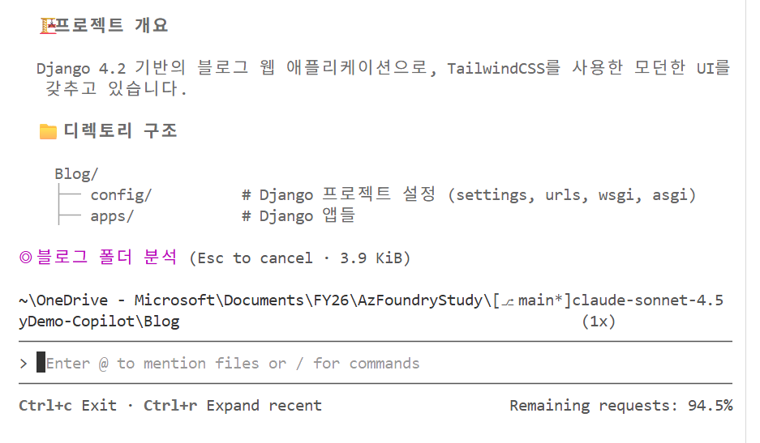

## GitHub CLI 사용법

1. VS Code의 터미널에서 Copilot 입력 후 엔터

    

2. /login 커멘드를 사용해서 로그인을 해야 함. 

    이 때 주의할 점은 EMU에 연결된 개인 계정(gmail.com 등)이 아닌 기업용 계정(taeyok_microsoft)를 사용해서 로그인을 해야 함. 그렇지 않으면, 다음과 같은 에러가 남

    ```No model available. Check policy enablement under GitHub Settings > Copilot```

3. /model 명령을 통해서 사용가능한 모델을 확인할 수 있다.

4. 프롬프트는 -p 옵션으로 입력하면 된다.
    
    > -p "Blog 폴더를 분석해줘"
    
    
